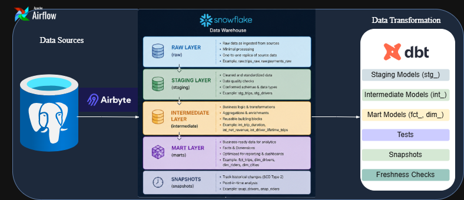
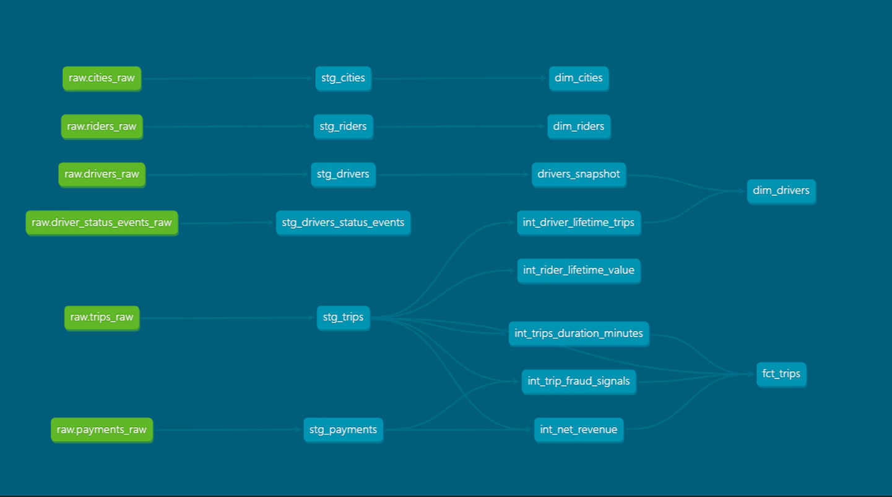
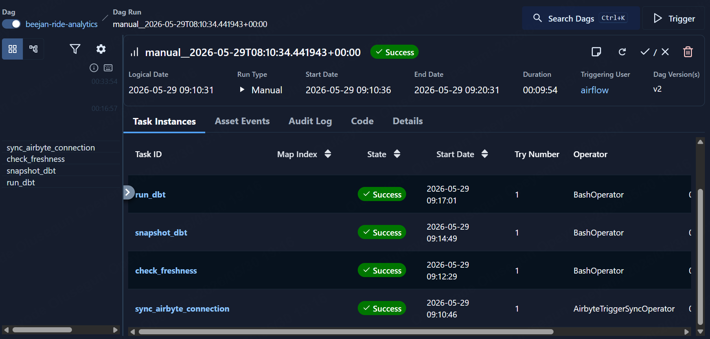

# *BeejanRide Analytics Platform*

## 📌 *Project Overview*
BeejanRide is a UK-based mobility startup providing ride-hailing, airport transfers, and scheduled corporate rides across multiple cities. This project implements a production-grade analytics engineering platform using the modern data stack.

The platform ingests transactional ride data from a PostgreSQL operational database into a cloud data warehouse using Airbyte, transforms and models the data using dbt, and orchestrates workflows using Apache Airflow.

### The final warehouse supports analytics use cases such as:
-   `Daily revenue reporting`
-   `Driver performance monitoring`
-   `Rider lifetime value analysis`
-   `Fraud detection`
-   `Payment reliability analysis`
-   `Corporate vs personal ride insights`

---
## ***Architecture Diagram***


---
## *Technology Stack*

| Tool           |	Purpose                         |
|----------------|----------------------------------|
| PostgreSQL     |	Source transactional database   |
| Airbyte        |  Data ingestion                  |
| dbt            |  Data modeling and transformation|
| Snowflake      |  Cloud data warehouse            |
| Apache Airflow |  Pipeline orchestration          |
| Git & GitHub   |  Version control                 |

---
## *Project Structure*
```bash
beejan-ride-analytics/
│
├── airflow-dags/
│   └── orchestration.py
│
├── dbt/
│   ├── models/
│   │   ├── staging/
│   │   ├── intermediate/
│   │   └── marts/
│   │
│   ├── snapshots/
│   ├── macros/
│   ├── tests/
│   ├── seeds/
│   ├── dbt_project.yml
│   └── profiles.yml
│
├── requirements.txt
└── README.md
```
---
## *Data Flow*
- `Transactional ride data is generated in PostgreSQL.`
- `Airbyte extracts and loads raw tables into the Snowflake RAW schema.`
- `dbt transforms the raw data into:`
    - `Staging models`
    - `Intermediate business logic models`
    - `Fact and dimension marts`
- `Apache Airflow orchestrates ingestion and transformation workflows.`
- `Final marts support BI dashboards and analytics reporting.`
---
## *Layered Modeling Approach*
### Raw Layer
Contains ingested source data from Airbyte without modifications.

*Examples:*
- `trips_raw`
- `drivers_raw`
- `riders_raw`
- `payments_raw`

### Staging Layer
The staging layer standardizes and cleans raw data.

*Transformations include:*
- `Column renaming to snake_case`
- `Data type casting`
- `Deduplication`
- `Timestamp standardization`
- `Null primary key removal`

*Examples:*
- `stg_trips`
- `stg_drivers`
- `stg_payments`

### Intermediate Layer
Contains reusable business logic and derived metrics.

*Implemented logic includes:*
- `trip_duration_minutes`
- `rider_lifetime_value`
- `driver_lifetime_trips`
- `net_revenue`
- `fraud indicators`
- `failed payment detection`
- `duplicate payment detection`

Reusable macros were created to standardize calculations and improve maintainability.

### Marts Layer
Implements a star schema for analytics consumption.

*Fact Tables:*
- `fct_trips`
- `fct_payments`

*Dimension Tables:*
- `dim_drivers`
- `dim_riders`
- `dim_cities`

The marts layer powers reporting and dashboarding use cases.

### Snapshots
Implemented SCD Type 2 snapshots for drivers.

*Tracked changes:*
- `driver_status`
- `vehicle_id`
- `rating`

Snapshotting enables historical tracking of driver state changes over time.

## *Incremental Models*
Incremental materialization was implemented for high-volume datasets such as:
- `stg_driver_status_events`
- `stg_trips`
- `stg_payments`

### *Why Incremental Models* ?
Incremental models reduce processing time and warehouse costs by only loading new or updated records instead of rebuilding entire tables.

---

# *Tradeoffs*
| Full Refresh	  | Incremental                           |
|-----------------|---------------------------------------|
| Simpler logic	  | Faster execution                      |
| Higher compute  | cost Lower compute cost            |
| Rebuilds entire | dataset	Processes only changes        |
| Better for small| datasets	Better for large datasets |

---
# ***Data Quality***

## Generic Tests

*Implemented:*
-   not_null
-   unique
-   relationships
-   accepted_values

## Custom Tests

*Implemented:*
-   No negative revenue
-   Trip duration greater than zero
-   Completed trips must have successful payments
-   Freshness Checks

## Configured Freshness Validation

The following source tables have freshness monitoring configured using `_AIRBYTE_EXTRACTED_AT` as the ingestion timestamp:

- `trips_raw`
- `payments_raw`
- `driver_status_events_raw`

*Freshness rules:*
- Warning threshold: data older than 1 day
- Error threshold: data older than 2 days
---
# ***Project Lineage***
## dbt Lineage Graph
The lineage graph below illustrates the dependencies between sources, staging models, intermediate layer and marts layer



---

# ***Documentation & Governance***
## The project includes:
- Model descriptions
- Column descriptions
- Business metric definitions

## Generated artifacts:
- dbt documentation site
- lineage graph
---

## ***Orchestration***
Pipeline orchestration was implemented using Apache Airflow.

**The Airflow DAG performs:**
- Airbyte ingestion trigger
- Source Freshness Check
- dbt transformation execution and Data quality validation

### Example workflow:
``text
sync_data >> check_freshness >> run_dbt 
```



---

Running the Project
Clone Repository
```bash
git clone https://github.com/yourusername/beejan-ride-analytics.git

cd beejan-ride-analytics
```
---
Start Docker Environment
```bash
docker compose up -d
```
Run dbt Models
```bash
dbt build
```
Run Tests
```bash
dbt test
```
Generate Documentation
```bash
dbt docs generate
dbt docs serve
```
---
Sample Analytical Queries
Daily Revenue by City
```sql
SELECT
    city_name,
    trip_date,
    SUM(net_revenue) AS total_revenue
FROM marts.fact_trips
GROUP BY 1,2
ORDER BY 2 DESC;
```
Top Drivers by Revenue
```sql
SELECT
    driver_id,
    SUM(net_revenue) AS revenue
FROM marts.fact_trips
GROUP BY 1
ORDER BY 2 DESC
LIMIT 10;
```
Failed Payments on Completed Trips
```sql
SELECT *
FROM marts.fact_payments
WHERE trip_status = 'completed'
AND payment_status = 'failed';
```
---
# *Key Design Decisions*

## Why dbt ?
dbt enables modular SQL transformations, testing, documentation, lineage tracking, and analytics engineering best practices.

## Why Snowflake ?
Snowflake provides scalable cloud warehousing with separation of storage and compute.

## Why Airflow ?
Airflow enables production-grade orchestration and scheduling of ingestion and transformation workflows.

## *Why Layered Architecture* ?
**The layered approach improves**:
- maintainability
- modularity
- reusability
- scalability
---
# *Future Improvements*

**Potential future enhancements:**
- CI/CD pipeline using GitHub Actions
- Real-time streaming ingestion
- Automated anomaly detection
- Cost optimization monitoring
- Data observability tooling
- Infrastructure as Code (Terraform)
- Role-based warehouse governance
---


